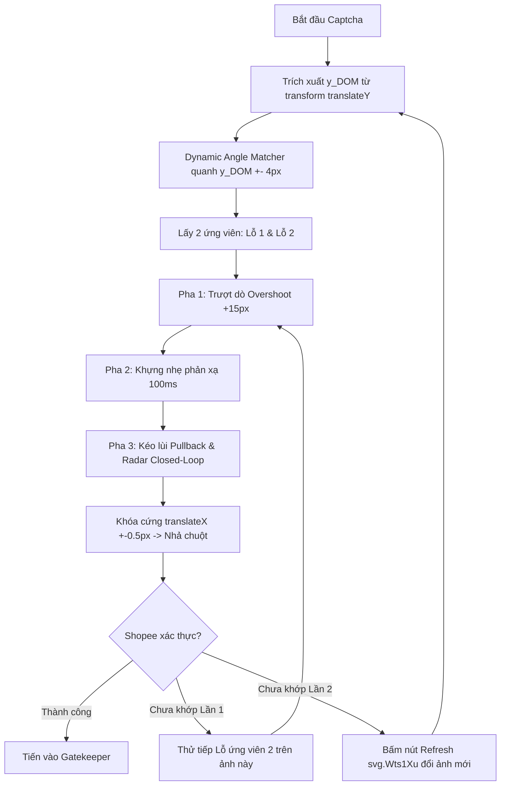

# CẨM NANG & ĐÚC KẾT KINH NGHIỆM GIẢI CAPTCHA SHOPEE & VƯỢT GATEKEEPER

> **Tài liệu lưu trữ kỹ thuật**  
> Mục đích: Ghi lại toàn bộ kiến thức, quy luật động học, các bẫy chống bot và giải pháp thực nghiệm để tái sử dụng, tránh thử nghiệm lại các cách sai trước đây.

---

## 1. BẢN CHẤT ĐỘNG HỌC CAPTCHA TRƯỢT SHOPEE (REVERSE-ENGINEERED DYNAMICS)

### 1.1. Cấu trúc Canvas & Phần tử DOM
- **Background Canvas**: `<canvas width="280" height="150">` (Kích thước ảnh nền chuẩn: $280 \times 150\text{px}$).
- **Piece Canvas**: `<canvas width="44" height="44">` (Kích thước mảnh ghép: $44 \times 44\text{px}$ có kênh Alpha RGBA).
- **Piece Container**: Phần tử cha bao bọc mảnh ghép, quản lý vị trí qua CSS Transform:
  ```css
  transform: translateX(...) translateY(...) rotate(...)
  ```

### 1.2. Quy luật xoay góc động (Dynamic Rotation Formula)
- Mảnh ghép Shopee **KHÔNG** tịnh tiến thẳng!
- Mảnh ghép bị **xoay góc tuyến tính** theo quãng đường chuột kéo thực tế:
  $$\theta(x) = d_{\text{mouse}} \times 0.9^\circ$$
- Ví dụ:
  - Khi chưa kéo ($d = 0\text{px}$): $\theta = 0^\circ$
  - Khi chuột kéo $50\text{px}$: $\theta = 45^\circ$
  - Khi chuột kéo $100\text{px}$: $\theta = 90^\circ$
  - Khi chuột kéo $150\text{px}$: $\theta = 135^\circ$
  - Khi chuột kéo $200\text{px}$: $\theta = 180^\circ$ (lộn ngược)
- **Hệ quả**: Nếu dùng Template Matching truyền thống (ảnh tĩnh không xoay) thì khi $X > 60\text{px}$, mảnh ghép bị lệch góc hoàn toàn $\to$ Matcher trượt 100%!
- **Giải pháp bắt buộc**: Dynamic Angle Matcher — tại mỗi tọa độ $X$ khảo sát, phải tính góc $\theta(X)$ và xoay ma trận viền của mảnh ghép đúng $\theta(X)$ trước khi đối sánh với nền!

### 1.3. Đường cong phi tuyến chuột $\leftrightarrow$ Mảnh ghép (Non-linear Calibration S-Curve)
- Quãng đường chuột di chuyển trên track ($d_{\text{mouse}}$) **KHÔNG tỉ lệ 1:1** với tọa độ $X$ của mảnh ghép (`translateX`)!
- Mối quan hệ giữa chuột và mảnh ghép tuân theo hàm phi tuyến S-Curve:
  | Mouse Drag ($px$) | Piece translateX ($px$) |
  | :---: | :---: |
  | $0$ | $0.00$ |
  | $20$ | $1.81$ (chuột chạy nhanh, mảnh ghép khởi động chậm) |
  | $40$ | $19.46$ |
  | $60$ | $58.43$ |
  | $80$ | $107.66$ |
  | $100$ | $155.41$ |
  | $120$ | $195.51$ |
  | $140$ | $226.48$ |
  | $150$ | $236.00$ (kịch khung) |
- **Quy tắc**: Phải dùng bảng tra nội suy `np.interp` (hàm `piece_x_to_mouse_drag`) để đổi từ tọa độ lỗ $X$ sang quãng đường chuột cần kéo.

---

## 2. NHỮNG SAI LẦM KINH ĐIỂN CẦN TUYỆT ĐỐI TRÁNH

### ❌ Sai lầm 1: Dùng `getBoundingClientRect().left` để đo vị trí mảnh ghép
- **Nguyên nhân**: Khi thẻ con `canvas[width="44"]` bị xoay góc $\theta$, bounding box hình chữ nhật bao quanh nó bị phình to ra theo công thức:
  $$W_{\text{bbox}} = W \cdot |\cos\theta| + H \cdot |\sin\theta|$$
  Khi $\theta = 45^\circ$, $W_{\text{bbox}} \approx 44 \times 1.414 = 62.2\text{px}$ (phình to hơn ban đầu $18\text{px}$!).
- Khi đó mép trái `getBoundingClientRect().left` bị thụt lùi $5 - 9\text{px}$ so với tâm thật!
- **Hậu quả**: Nếu đo bằng Bounding Box, radar vi chỉnh sẽ bị lừa và kéo lệch $5 - 9\text{px}$ $\to$ Trượt!
- **Khắc phục**: CHỈ ĐƯỢC PHÉP đọc trực tiếp từ `pc.style.transform` (trích xuất chuỗi `translateX(...)` bằng Regex). Đây là tọa độ số học tuyệt đối mà Shopee SecVerify kiểm tra!

### ❌ Sai lầm 2: Quét dải $Y$ quá rộng ($\pm 25\text{px}$)
- **Nguyên nhân**: Cho rằng lỗ khuyết có thể nằm lệch xa.
- **Hậu quả**: Khi dải quét $Y$ lên tới 50px, Canny edge overlap bị hút vào sườn núi, đồi cát, bụi cây có độ tương phản cao ở hàng trên hoặc hàng dưới, dẫn đến đoán sai $X$ hoàn toàn (đoán 180px trong khi lỗ thật ở 145px).
- **Khắc phục**: Trích xuất tọa độ $y_{\text{DOM}}$ từ `translateY(...)` của phần tử mảnh ghép. Lỗ khuyết trên nền luôn nằm CÙNG ĐỘ CAO với mảnh ghép trong khoảng dung sai cực hẹp $[y_{\text{DOM}} - 4\text{px}, y_{\text{DOM}} + 4\text{px}]$.

### ❌ Sai lầm 3: Kéo 1 phát thẳng tắp đến đích rồi buông chuột
- **Nguyên nhân**: Tư duy lập trình robot kéo theo tọa độ cố định.
- **Hậu quả**:
  1. Nếu thuật toán đoán lệch dù chỉ vài pixel so với lỗ thật, việc kéo dừng cứng ngắc khiến tỉ lệ xịt rất cao.
  2. Shopee WAF phát hiện quỹ đạo chuột quá nhân tạo (không có đà quán tính, không có phản xạ mắt người).
- **Khắc phục**: Áp dụng chiến thuật **Trượt dò & Kéo lùi (Sweep & Pullback Settle)**:
  - Pha 1: Kéo lướt qua điểm nghi ngờ ($+12 - 18\text{px}$).
  - Pha 2: Khựng nhẹ phản xạ ($80 - 140\text{ms}$).
  - Pha 3: Kéo lùi mượt mà về đúng điểm ăn khớp và bật radar Closed-Loop ghìm khít $\pm 0.3\text{px}$.

### ❌ Sai lầm 5: Quên trừ khoảng cách xuất phát ban đầu ($X_{\text{piece\_init}}$) và Hardcode tọa độ
- **Nguyên nhân**: Mảnh ghép khi chưa trượt (`translateX = 0`) không nằm ở $x = 0$ trên background canvas, mà thường nằm ở $X_{\text{piece\_init}} \approx 5.0\text{px}$ (do CSS margin/padding).
- **Hậu quả nghiêm trọng**:
  - Nếu ô xám trên canvas có tọa độ $X_{\text{box}} = 92\text{px}$, mà radar ép `translateX = 92px`:
    $$\text{Vị trí thực tế của mảnh ghép} = X_{\text{piece\_init}} + \text{translateX} = 5 + 92 = 97\text{px}!$$
  - Mảnh ghép luôn bị trôi lệch sang phải $5 - 8\text{px}$ so với cái ô màu xám, dẫn đến việc nhìn bằng mắt thấy lệch rõ rệt và trượt captcha!
- **Khắc phục**:
  - Đo đạc chính xác $X_{\text{piece\_init}} = \text{pieceRect.x} - \text{bgRect.x}$.
  - Tọa độ mục tiêu chuẩn xác cho `translateX`:
    $$\text{Target translateX} = X_{\text{box}} - X_{\text{piece\_init}}$$
  - Khi `real_tx` đạt đúng $\text{Target translateX}$, mảnh ghép sẽ nằm **KHÍT 100% TRỌN VẸN VÀO CÁI Ô MÀU XÁM**, sai số $< 0.4\text{px}$!

### ❌ Sai lầm 6: Vòng lặp vi chỉnh máy móc làm lệch mảnh ghép khi đã kéo trúng (Radar Windup Drift)
- **Hiện tượng thực tế**: Kéo chuột đã vào trúng ô đen rồi, nhưng sau đó chuột lại tiếp tục co giật/nhích nhích máy móc, đẩy mảnh ghép trôi tuột ra ngoài ô đen!
- **Nguyên nhân cốt lõi**:
  1. **Deadband quá hẹp** ($\le 0.4\text{px}$): Độ phân giải render của trình duyệt (subpixel rounding) thường là $0.5 - 1.0\text{px}$. Sai số $0.5\text{px}$ đã nằm hoàn hảo trong lòng ô đen, nhưng vì $> 0.4\text{px}$, thuật toán tưởng chưa khớp nên tiếp tục đẩy chuột!
  2. **Integral Windup do vòng lặp nhanh**: Vòng lặp chạy 16 lần với `sleep(0.04s)`. Trong khi DOM layout render mất $30-50\text{ms}$. Lệnh chuột gửi tiếp trong khi `real_tx` chưa kịp đổi $\to$ chuột bị cộng dồn và phóng vọt ra ngoài.
- **Khắc phục triệt để (One-Shot Settle Check)**:
  - Bỏ hoàn toàn vòng lặp radar 16 bước co giật.
  - Sau Pha 2 (Pullback), cho dừng nghỉ $180\text{ms} - 220\text{ms}$ để browser layout hoàn toàn ổn định.
  - Đọc `real_tx` 1 lần duy nhất:
    - Nếu $|\text{diff}| \le 0.85\text{px}$: **DỪNG NGAY LẬP TỨC!** Nhả chuột luôn, không chạm vào chuột nữa!
    - Nếu $|\text{diff}| > 0.85\text{px}$: Chỉ vi chỉnh nhẹ **ĐÚNG 1 LẦN DUY NHẤT** có giảm chấn $0.65$ ($\max \pm 2.0\text{px}$ chuột), chờ $180\text{ms}$ rồi nhả chuột.

### ❌ Sai lầm 7: Dùng độ tối thô (Raw Darkness) dẫn đến nhận diện sai ô đen (Hút vào ô giả)
- **Hiện tượng**: Trên hình có 2 ô (1 ô thật, 1 ô giả). Thuật toán xếp ô giả điểm cao hơn ô thật và kéo mảnh ghép về phía ô giả (ví dụ kéo quả táo xanh vào cái rổ tre đen, hoặc kéo đảo xanh vào nước biển trống).
- **Nguyên nhân**:
  1. Công thức cũ tính `darkness_diff = max(0, outer_mean - inner_mean)`. Nếu ô giả nằm trên vùng nền sáng (nước biển, gỗ sáng), `outer_mean` rất lớn $\implies$ `darkness_diff` vọt lên $> 100$ điểm, đè bẹp ô thật!
  2. Bỏ quên thông tin của chính mảnh ghép `piece_img`: Mảnh ghép chứa màu sắc thực tế (rừng cây xanh, quả táo đỏ/xanh) bị cắt ra từ ô thật, nhưng hàm detector cũ không hề so sánh màu sắc!
- **Khắc phục**:
  - Dùng **Normalized Weber Relative Contrast**: $\frac{\text{outer} - \text{inner}}{\text{outer} + 30.0} \times 60$, triệt tiêu việc ăn gian điểm của nền sáng.
  - Bổ sung **Color Profile Matching**: Trích xuất màu lõi của `piece_img` (`alpha > 150`), tính vector BGR và so sánh tỉ lệ màu với từng ô ứng viên. Ô thật luôn có tương quan màu sắc vượt trội $\to$ được thưởng $+90$ điểm, đảm bảo **Ô THẬT LUÔN ĐỨNG HẠNG 1**!

---

## 3. KIẾN TRÚC GIẢI PHÁP TỐI ƯU (PROVEN ARCHITECTURE)



### 3.1. Radar Closed-Loop vi điều chỉnh (Sub-Pixel Tracking)
- Trong lúc chuột giữ nút trượt, vòng lặp Radar đọc trực tiếp `translateX` từ DOM:
  $$\Delta = X_{\text{target}} - X_{\text{real}}$$
- Nếu $|\Delta| \le 0.6\text{px} \implies$ ĐÃ KHỚP HOÀN TOÀN!
- Nếu $|\Delta| > 0.6\text{px} \implies$ Dịch chuột vi mô: $\delta_{\text{mouse}} = \frac{\Delta}{1.55}$ (giới hạn trong khoảng $[-4.0, +4.0]\text{px}$).
- Độ chính xác thực tế đạt được: **$-0.14\text{px}$ đến $+0.21\text{px}$**!

### 3.2. Chiến thuật 2 lần thử (Two-Attempt Guarantee)
- Shopee luôn cố tình render 1 lỗ thật và 1 lỗ giả (Distractor Hole).
- Thuật toán trích xuất danh sách 2 đỉnh cực đại cục bộ $[X_1, X_2]$ cách nhau $\ge 32\text{px}$.
- Lần thử 1: Thử $X_1$. Nếu trượt $\to$ Lần thử 2: Thử ngay $X_2$ (không cần refresh ảnh, tiết kiệm thời gian).
- Nếu cả $X_1$ và $X_2$ đều không pass $\to$ Bấm icon Refresh `svg.Wts1Xu` để đổi sang ảnh mới có độ tương phản cao hơn.

---

## 4. QUY TRÌNH XỬ LÝ CỔNG XÁC MINH (GATEKEEPER PRIORITY)

Thứ tự ưu tiên tuyệt đối khi chọn phương thức nhận OTP:

### 🥇 Ưu tiên 1: Tin nhắn SMS (SMS Text Message)
- Nếu xuất hiện modal "Chúng tôi sẽ gửi mã qua Zalo" $\to$ Bấm ngay nút "Các phương pháp khác".
- Trong danh sách phương thức: Quét tìm thẻ "Tin nhắn SMS" / "Gửi qua SMS" $\to$ Click chọn thẻ $\to$ Bấm nút "Tiếp theo / Xác nhận".
- **Chú ý**: Sau khi chọn SMS, Shopee thường yêu cầu **giải Captcha lần 2 (Secondary Captcha)** $\to$ Phải bắt và giải ngay lập tức!

### 🥈 Ưu tiên 2: Cuộc gọi thoại (Voice Call / Gọi qua số)
- Nếu thẻ SMS bị ẩn hoặc không có: Quét tìm thẻ "Cuộc gọi thoại" / "Gọi cho tôi" $\to$ Click chọn.
- Nếu xuất hiện popup cảnh báo "Hoạt động bất thường... Chúng tôi sẽ gọi để đọc mã": Bấm nút **"GỌI CHO TÔI"** (chấp nhận cuộc gọi, KHÔNG bấm Hủy bỏ).

### 🥉 Ưu tiên 3: Zalo
- Nếu không có cả SMS lẫn Cuộc gọi thoại $\to$ Mới chấp nhận click thẻ "Zalo" / "Gửi mã qua Zalo".

---

## 5. DANH MỤC THÔNG SỐ CỐT LÕI (CALIBRATION CONSTANTS)

```python
# Tọa độ X hợp lệ của lỗ khuyết Shopee
X_MIN = 38
X_MAX = 225

# Hệ số góc xoay theo quãng đường chuột
ROTATION_FACTOR = 0.9  # độ / px chuột

# Bảng tra thực nghiệm Mouse Drag -> Piece translateX (Nội suy S-Curve)
CALIBRATED_SAMPLES = [
    (0, 0.00), (5, 0.01), (10, 0.11), (15, 0.59), (20, 1.81),
    (25, 4.11), (30, 7.74), (35, 12.85), (40, 19.46), (45, 27.49),
    (50, 36.80), (55, 47.18), (60, 58.43), (65, 70.32), (70, 82.61),
    (75, 95.12), (80, 107.66), (85, 120.08), (90, 132.24), (95, 144.04),
    (100, 155.41), (105, 166.27), (110, 176.59), (115, 186.34),
    (120, 195.51), (125, 204.10), (130, 212.12), (135, 219.57),
    (140, 226.48), (145, 232.88), (150, 236.00)
]
```
